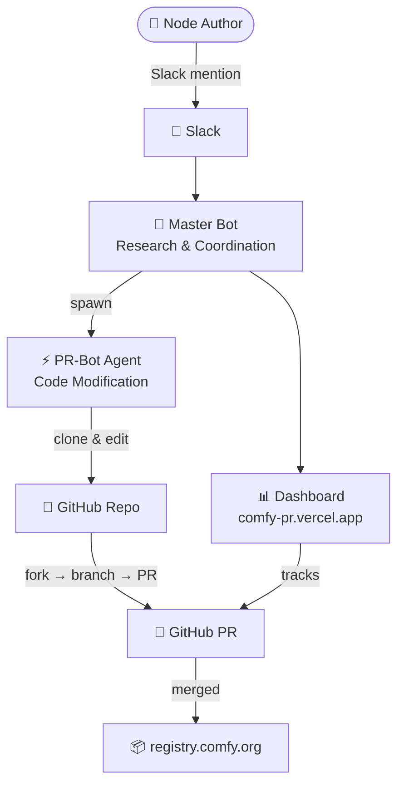

# Architecture Diagram — for Video Scene 4

Use this as the basis for a visual diagram asset in the video.

---

## Diagram: How Comfy-PR Works

```
┌─────────────────────────────────────────────────────────────────┐
│                        COMFY-PR PLATFORM                        │
│                                                                  │
│   User / Author                                                  │
│       │                                                          │
│       │ "@comfyprbot publish github.com/user/my-node"           │
│       ▼                                                          │
│  ┌──────────┐                                                    │
│  │  Slack   │                                                    │
│  └────┬─────┘                                                    │
│       │                                                          │
│       ▼                                                          │
│  ┌────────────────────────────────────┐                          │
│  │   MASTER BOT (Research Agent)      │                          │
│  │   • Reads Slack threads            │                          │
│  │   • Searches Notion / GitHub       │                          │
│  │   • Coordinates work               │                          │
│  └────────────────┬───────────────────┘                          │
│                   │  spawn                                       │
│                   ▼                                              │
│  ┌────────────────────────────────────┐                          │
│  │   PR-BOT AGENT (Coding Sub-Agent)  │                          │
│  │   • Clones repo to /repos/         │                          │
│  │   • Edits pyproject.toml           │                          │
│  │   • Adds GitHub Actions workflow   │                          │
│  │   • Commits → Branch → PR          │                          │
│  └────────────────┬───────────────────┘                          │
│                   │                                              │
│                   ▼                                              │
│  ┌──────────────────────────┐                                    │
│  │        GitHub            │                                    │
│  │  Fork → Branch → PR      │ ──→ registry.comfy.org            │
│  └──────────────────────────┘                                    │
│                                                                  │
│  ┌──────────────────────────┐                                    │
│  │   Dashboard              │                                    │
│  │   comfy-pr.vercel.app    │  (tracks all PR states)           │
│  └──────────────────────────┘                                    │
└─────────────────────────────────────────────────────────────────┘
```

---

## Simplified 3-Step Version (for video overlay text)

```
[Slack Command]  →  [AI Agents]  →  [GitHub PR]
                         ↓
                   [Dashboard]
```

---

## Recommended Visual Style

- Dark background (#1a1a2e or similar)
- Accent color matching ComfyUI brand (orange/gold)
- Animated arrows flowing downward left-to-right
- Each box appears with a subtle fade-in, sequenced with narration
- Tool: Figma, Mermaid.js, or Excalidraw

---

## Mermaid Source (for rendering in docs or code)


